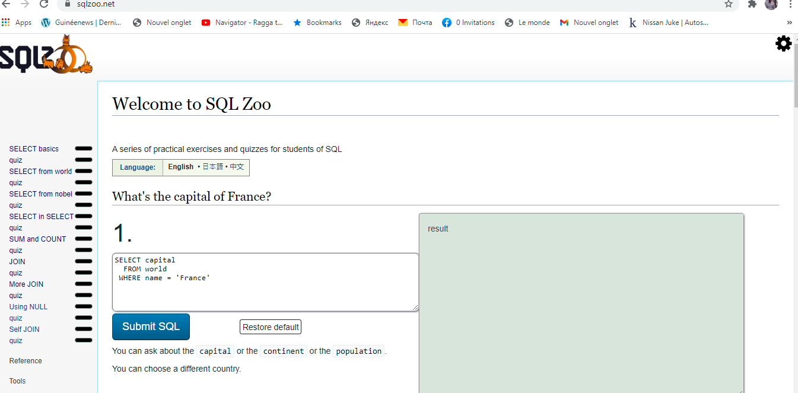

# MySQL

# Project: SQL Zoo
- SQL Zoo is one of the few resources online that actually lets you build and run queries against existing tables. Each tutorial will show you a table and then have you run queries against it to answer specific questions. Some of the queries, particularly at first, are quite simple. They definitely get more challenging towards the end and can be real head scratchers.

# Getting Started

- This project contains all questions and answers to them from 
  [SQL ZOO Tutorial](https://sqlzoo.net/wiki/SELECT_from_WORLD_Tutorial)

## On your Computer

To get a local copy up and running follow these simple example steps.

### Prerequisites

- Any PC or device with an internet connection and ability to use the command
  line terminal

### Setup

- Open the command line terminal

### Install

- Go to your preferred directory
- Run `git clone  https://github.com/billodiallo/slq_database.git` 

- cd `sql_database` 

### Usage

- Open the cloned repo in your preferred text editor
- Questions and answers placed in respectively named SQL files

## Built with

- Virtual Studio Code

## Author
👤 **Billo Diallo**

- GitHub:[@billodiallo](https://github.com/billodiallo)
- Twitter: [@BilloDi83547008](https://twitter.com/BilloDi83547008)
- Linkedin:[@mabillodiallo](https://www.linkedin.com/in/mabillodiallo/)

## 🤝 Contributing

Contributions, issues, and feature requests are welcome!

## Show your support

Give a ⭐️ if you like this project!

## Acknowledgments

- goodprogrammer.ru

## 📝 License

This project is [UNLicense](./LICENSE) licensed.
